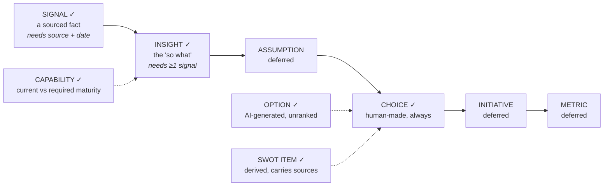

# Strategy Journey Platform — Prototype v0.1

**Scope: Consultant Workspace only. One vertical slice, end to end, on real Postgres.**

Full specification: *SP Delivery Portal Blueprint v1.0* (3 Aug 2026), with fourteen corrections.
This file governs the prototype. Anything not listed under [In scope](#3-in-scope) is **out** — including things the blueprint specifies. Do not build ahead.

## Companion documents — read before writing code

| File | What it defines | Read before |
|---|---|---|
| `supabase/migrations/0001_prototype_schema.sql` | The schema, intake triggers, the `ai_service` role boundary, `node_provenance()` | Anything |
| `supabase/tests/0001_schema_assertions.sql` | 30 assertions the database must satisfy. **Run this first — the migration has not been executed.** | Anything |
| `docs/graph-queries.md` | Binding grammar, query registry contract, the seven ViewModels | Deck composer, any graph read |
| `prompts/swot-derivation.v1.md` | Tool schema, system prompt, post-processing rules | Step 5 |
| `prompts/option-generation.v1.md` | Tool schema, system prompt, anti-ranking enforcement | Step 6 |
| `supabase/seed.sql` | One realistic engagement — 18 signals, 4 insights, 12 capabilities | Anything |

⚠️ **The migration has never been run.** It was written and reviewed by inspection because Postgres was not available in the authoring environment. Three defects were caught that way (missing `citext`, a `NULLS NOT DISTINCT` gap, a missing SELECT policy that would have made every AI call return zero rows). **Assume one or two more remain.** Run `npm run db:reset && npm run db:assert` before anything else and fix what the assertions catch.

## Directory layout

```
/app                        Next.js App Router
  /(workspace)              Consultant Workspace routes
    /engagements/[id]
      /signals              intake + list
      /insights
      /capabilities         inventory, scoring, heatmap
      /swot                 derived, editable
      /options              generated, unranked
      /choice               human-only
      /coherence            findings
      /deck                 compose + render
      /nodes/[nodeId]       provenance viewer
  /api
    /engagements/[id]/nodes
    /engagements/[id]/derive/[artifact]
    /engagements/[id]/coherence/run
    /decks/[templateId]/render
    /findings/[id]/accept

/lib
  /graph
    /queries                registry.ts + one file per binding
    provenance.ts           wraps node_provenance()
    staleness.ts
  /ai
    service.ts              THE ONLY place the Anthropic SDK is imported
    /derivations
      swot.ts
      options.ts
  /charts                   SVG only — consumed by portal AND deck
    heatmap.ts
    quad-grid.ts
  /deck
    compose.ts              binding -> ViewModel -> layout
    /layouts                one per layout_id
  /coherence
    checks.ts               C1, C2, C3 in a registry keyed by id
  /db                       supabase clients (human + ai_service)

/theme
  sp-theme.ts               BLOCKER: extract from SP's PowerPoint template

/prompts                    versioned prompt files (see companions)
  /evals                    golden cases

/supabase
  /migrations
  /tests
  seed.sql

/docs
  graph-queries.md
  /adr                      one per non-obvious decision

/tests
  /critical                 intake, AI write restriction, RLS — every commit
```

---

## 1. What the prototype must prove

One thing, demonstrated live to the SP practice lead:

> A strategist opens a generated PowerPoint slide, points at a SWOT item, and the system answers **"why is this here?"** with a chain — this item, from these two insights, which rest on these four sourced signals, captured on these dates from these sources.

And the corollary, which is what actually decides the project:

> **The strategist looks at the generated deck and does not want to rebuild it in PowerPoint.**

If v0.1 achieves both, the architecture is validated and Phase 1 proceeds. If the deck looks generic, that is the finding — report it rather than papering over it with more features.

### What this prototype is NOT

Not a demo of breadth. It deliberately covers a narrow path through Stage A/B/C rather than all fifteen inputs. Breadth is more forms; it is not more risk. Do not let scope drift toward completeness.

---

## 2. Non-negotiables

Even in a prototype. These are the architecture, and retrofitting them costs more than building them now.

| # | Rule | Enforced by |
|---|---|---|
| 1 | Every signal carries a resolvable source and a date | DB constraint trigger + API |
| 2 | Every insight cites ≥1 signal | DB constraint trigger + API |
| 3 | **The AI can create `option` nodes and CANNOT write a `choice` node or `decision_log` row** | Separate Postgres role + RLS policy, tested in CI |
| 4 | The deck is a rendering of the graph, never the source | `slide_spec` bindings resolve against a query registry |
| 5 | Every choice is logged with its alternatives and rationale | `decision_log` required before choice approval |
| 6 | Options are generated in sets, never ranked, never recommended | Prompt + API contract |

**Rule 3 is the commercial line of the entire product.** A client who suspects the machine chose will not pay strategy fees. It is enforced with database permissions, never a prompt instruction — a prompt saying "do not decide" will eventually be circumvented by a well-meaning feature, and the circumvention will be invisible in the output. A permission boundary fails loudly. Test it explicitly.

---

## 3. In scope

Ten modules. Roughly six to eight weeks solo.

| # | Module | What it does |
|---|---|---|
| 1 | **Engagement setup** | Name, client org, horizon, the questions the strategy must answer. One engagement, seeded. |
| 2 | **Signal intake** | Manual entry. Source (uri or interview), publication date, retrieval date, excerpt, credibility, dimension tag. The atomic unit of the whole system. |
| 3 | **Insight capture** | Free text + required links to ≥1 signal. Confidence level. |
| 4 | **Capability inventory + assessment** | Flat-to-two-level hierarchy. Consultant enters current maturity, required maturity, criticality. Heatmap view. |
| 5 | **Derived SWOT** | AI derivation from capability assessment + dimension-tagged signals. Every item carries its source nodes. Deletion requires a reason. |
| 6 | **Option generation** | AI generates ≥5 growth options with trade-offs, prerequisites, strongest argument against, evidence nodes. Unranked. |
| 7 | **Choice + decision log** | Human-only. Records the choice, the alternatives considered, rationale, decider, revisit trigger. |
| 8 | **Coherence Engine (deterministic only)** | Checks C1, C2, C3. Findings list with node links, accept-with-note creating a decision log entry. |
| 9 | **Deck Composer** | Seven slides, SP theme, genuinely editable PPTX. |
| 10 | **Provenance viewer** | Click any node anywhere → full upstream chain to sourced signals, with dates and sources. |

### Signals carry a dimension tag instead of full registers

SWOT derivation needs opportunities and threats from PESTEL, market and competitor evidence — but building the PESTEL factor register, market sizing and competitor profile forms is Stage A breadth we are deferring. Instead, `signal.payload.dimension` is set at intake:

`pestel_political | pestel_economic | pestel_social | pestel_technological | pestel_environmental | pestel_legal | market | competitor | internal | customer`

That is enough for the derivation to work and enough for the demo. The full registers become views over the same signals in Phase 1 — no migration.

### Capability scoring is consultant-entered

Workshop Mode is out of scope, so the "score independently, then show the divergence" mechanic (Blueprint §9.3) is deferred. Add `assessment.scoring_mode` = `consultant | workshop` now, defaulting to `consultant`, and store scores in a `capability_score` table keyed on (capability, respondent) even though the prototype has exactly one respondent. **Adding Workshop Mode later then becomes a new input path, not a schema migration.**

---

## 4. Explicitly out of scope

Do not build these. If one seems necessary, that is scope creep — flag it rather than starting.

**Surfaces:** Workshop Mode, SMO Cockpit.
**Stage A breadth:** research agent, PESTEL factor register, driving forces, scenario definition, market sizing, competitor profiles, executive interview capture.
**Stage B breadth:** business model canvas + variants, Penta Model, customer segments, JTBD capture, value proposition canvas.
**Stage C breadth:** problem register, GTM scenarios + economics, full PTW cascade, red team.
**Stages D and E entirely:** objectives, initiatives, sequencing, platform alignment, governance, review packs, handover gate, import path.
**Coherence:** judgement checks C7–C10 (they need a model call and human confirmation UI — additive, not architectural).
**Infrastructure:** background job queue, multi-tenancy beyond one row, auth beyond a single hardcoded user, residency/in-region deployment, observability stack beyond console logging.

Two exceptions worth honouring even now: **do not use Vercel-only primitives** (Edge Config, Vercel KV, Vercel Blob) — the production system needs an in-region AWS path and these do not travel. Use Supabase Storage and Postgres. And **keep every Anthropic call behind `/lib/ai/service.ts`** from the first call.

---

## 5. The graph

Six node types on the spine, four feeding in. The prototype uses a subset (marked ✓).



**Edge types in v0.1:** `derives_from`, `supports`, `contradicts`, `considered_for`.

**Every graph entity gets a `node` row.** Typed tables (`capability`, `swot_item`, `option_detail`) extend it via `node_id`. This corrects a defect in the blueprint, which listed some entities as standalone tables while also drawing edges to them — `edge.from_node` cannot polymorphically reference four tables, and the provenance query breaks the moment a chain crosses one.

**No Postgres array columns for node references.** Arrays cannot carry foreign keys, so nothing prevents them pointing at deleted or cross-engagement rows. Use `edge` rows or explicit join tables.

---

## 6. Intake rules — enforce in the database

The blueprint enforced these at the API layer only. That is insufficient: you will write a seed script or an import that bypasses the API, and unsourced nodes will enter invisibly, breaking the traceability chain that justifies the whole architecture.

| Node | Cannot exist without |
|---|---|
| `signal` | a `signal_source` row with a resolvable uri-or-interview reference and a `published_at` date |
| `insight` | ≥1 inbound `supports` edge from a signal |
| `choice` | ≥1 linked insight or swot_item, a `decision_log` row with alternatives, a named human decider |

Implement as deferrable constraint triggers so a node and its source insert in one transaction. Keep the API validation too — it produces better error messages. The DB constraint is the backstop, and it is the one that survives a migration script.

**An interview is a valid source.** "The CFO said this, on this date" satisfies the rule. What is not valid is a fact a consultant is simply confident about.

---

## 7. Derivations

### SWOT

Strengths and weaknesses computed from the capability assessment. Opportunities and threats from signals tagged `pestel_*`, `market`, `competitor`.

- Every item stores its contributing node ids as `derives_from` edges.
- A model **ranks and phrases**; a human edits.
- **Deletion requires a recorded reason**, so evidence is not silently discarded. This is an acceptance criterion, not a nicety — it is the mechanism that stops a derived artifact quietly becoming an opinion.

### Options

```
Generate at least five materially different options spanning the space
(deeper penetration, adjacent segments, new geographies, new business models,
partnership, acquisition).

For each: the bet, the prerequisite capabilities, what must be true for it to
work, the strongest argument against it, and the evidence nodes it rests on.

At least one option must require capabilities the client does not currently have.

Do not rank them. Do not recommend one.
If the evidence is insufficient to assess an option, say so in open_questions.
```

A weak option set is worse than none — it makes a poor choice look considered. Use Sonnet 5 here; this is the hardest generative task in the prototype.

### Model allocation

| Task | Model |
|---|---|
| SWOT derivation (ranking + phrasing) | Sonnet 5 |
| Slide narrative + speaker notes | Sonnet 5 |
| Growth option generation | Sonnet 5 |

Structured output via tool use throughout. Log every call to `ai_run` with `accepted` — the proportion of generated content a consultant actually keeps is the only honest measure of whether the AI layer earns its place.

---

## 8. Coherence Engine — deterministic checks only

| ID | Check |
|---|---|
| C1 | Every choice traces to at least one insight or SWOT item |
| C2 | Every insight cites at least one sourced, dated signal |
| C3 | Every capability assessed below required maturity is either referenced by a choice or explicitly noted |

Runs on every node/edge change, incrementally, for affected checks. Findings are `open` → `accepted` | `resolved`. **Accepting requires a note and creates a `decision_log` entry** — a strategy may legitimately contain a known incoherence, but it should be a recorded choice rather than an oversight.

C3 is a v0.1 stand-in for the blueprint's C8, which needs the "how to win" element of the PTW cascade. Keep the check-id registry structured so C4–C10 slot in without refactoring.

Deterministic and judgement findings must remain **visually distinct** in the UI when C7–C10 arrive. Mixing them teaches users to distrust the reliable ones.

---

## 9. The Deck Composer

**This is the module that decides whether the prototype succeeds.** Give it disproportionate time.

Seven slides:

| # | Slide | Binding | Narrative |
|---|---|---|---|
| 1 | Cover | engagement metadata | static |
| 2 | Evidence base | `signals.summary(by_dimension)` | generated |
| 3 | Capability heatmap | `capabilities.heatmap(level=2, colour_by=gap)` | generated |
| 4 | Priority capability gaps | `capabilities.gaps(top=8)` | generated |
| 5 | SWOT | `swot.derived()` | generated |
| 6 | **Options considered** | `options.all()` | generated |
| 7 | **Choice and rationale** | `choice.selected() + decision_log` | generated |

Slides 6 and 7 are the pair most strategy decks omit and most boards want: *what else was considered, and why this instead.* The graph holds both, so including them costs nothing beyond the decision to be transparent. They are also the clearest demonstration of Rule 3 — options are machine-generated, the choice beside them is not.

### Hard requirements

- **Genuinely editable PPTX.** Editable text, editable native charts, correct SP theme colours and fonts. Never images of slides. If a strategist cannot fix a typo in PowerPoint, the feature has failed.
- **One SVG chart pipeline** in `/lib/charts/`, consumed identically by the on-screen portal and the deck. A heatmap must not look different in two places.
- **`locked` flag** preserves manual edits across regeneration, and sets `unbacked = true`. Track `unbacked_slide_count` per render. This resolves a contradiction in the blueprint — Principle 2 says the deck is never the source, while §14 allows manual slides. Both are needed; the fix is to make graph drift **measured rather than silent**.
- **Instrument slides-edited-after-generation from the very first render.** If that number is not falling by the third engagement, the problem is real and the fix is design, not more features.

### The SP theme is a blocker, not a finishing task

Appendix C item 6. Extract theme colours, fonts and layout geometry from Strategy Platforms' existing PowerPoint template and encode as a first-class asset in `/theme/sp-theme.ts`. **Do this before building slides 2–7.** A prototype rendered in a default theme tests the wrong question and will be judged on the wrong axis.

---

## 10. Stack

| Layer | Choice |
|---|---|
| Frontend | Next.js 15 (App Router), TypeScript, Tailwind, shadcn/ui |
| Backend | Next.js route handlers + server actions |
| Database | Postgres via Supabase (local dev via CLI) |
| AI | Anthropic API — Sonnet 5, Opus 4.8. All calls via `/lib/ai/service.ts` |
| Deck | `pptxgenjs` server-side |
| Charts | Server-rendered SVG |
| Rendering | Synchronous for v0.1 with a loading state. Deck render must complete under 60s for 7 slides — if it does not, move to a job runner rather than raising the timeout. |

---

## 11. Acceptance criteria

The prototype is done when all of these pass on a real engagement's data, not fixtures.

1. A signal cannot be saved without a resolvable source and a date — verified by attempting it directly against Postgres, bypassing the API.
2. An insight cannot be saved without at least one linked signal — same verification.
3. **The AI service credential cannot insert or update a `choice` node or a `decision_log` row.** Tested in CI with an explicit failing write.
4. The option generator produces ≥5 distinct options with stated trade-offs and never a recommendation.
5. A derived SWOT item cannot be deleted without a recorded reason.
6. Every SWOT item on slide 5 resolves to at least one signal, and the UI shows which.
7. Clicking any node returns its full upstream chain to sourced signals with dates and sources — the §1 test.
8. Generated PPTX opens in PowerPoint **and** Google Slides with editable text, editable charts, correct SP theme.
9. Regeneration after a graph change preserves locked slides and updates unlocked ones; the render report lists what changed.
10. The capability heatmap renders identically on screen and in the deck.
11. A 7-slide deck renders in under 60 seconds.
12. A strategist who did not build it completes a full signal → insight → SWOT → choice → deck cycle from a one-page written instruction.

Criterion 12 is the real one. The others are necessary; that one tells you whether it is usable.

---

## 12. Build order

Each step ends somewhere demonstrable. Do not start the next until the current one works.

| Step | Build | Demonstrable at the end |
|---|---|---|
| 1 | Schema + constraint triggers + RLS + AI role. Migration `0001`. | Invalid writes fail at the database. CI proves the AI cannot write a choice. |
| 2 | SP theme extraction into `/theme/`. Slide 1 renders. | An editable, correctly branded PPTX exists. |
| 3 | Signal intake + insight capture + provenance viewer. | The chain works on screen. |
| 4 | Capability inventory, scoring, heatmap. Slides 3–4. | Heatmap identical on screen and in deck. |
| 5 | SWOT derivation. Slide 5. | A derived item traces to its evidence in the deck. |
| 6 | Option generation + choice + decision log. Slides 6–7. | Rule 3 demonstrated live. |
| 7 | Coherence C1–C3. | A finding fires, is accepted with a note, and appears in the decision log. |
| 8 | Polish, instrumentation, criterion 12 dry run. | Practice lead demo. |

Step 2 before step 3 is deliberate. Finding out in week two that the deck looks wrong is recoverable; finding out in week seven is not.

---

## 13. Conventions

- **Migrations** — one per PR, reversible, never edited after merge. Schema is the contract.
- **ADRs** in `/docs/adr/` for anything a future developer would otherwise reverse. Start with: node-backed typed tables, no array FKs, DB-level intake enforcement, the AI role boundary.
- **Prompts** are versioned files in `/prompts/`, referenced by `ai_run.prompt_template_id` + `prompt_version`. Never inline a prompt in application code.
- **Graph queries** live in `/lib/graph/queries/` as named, tested functions. `slide_spec.data_binding` resolves against this registry — never against arbitrary SQL.
- **Charts** render from `/lib/charts/` as SVG only.
- **Critical test suite** runs on every commit: intake enforcement, AI write restriction, RLS isolation.

---

## 14. Deferred deliberately — log, don't forget

Carried from the full blueprint. Each is a known gap, not an oversight.

| Deferred | Why it matters later |
|---|---|
| Independent scoring + divergence display | The most valuable design detail in Stage B. `capability_score` is keyed for it now. |
| Research agent | Fills the graph at volume. Its one hard rule when built: **it proposes, it never inserts.** No auto-accept at any confidence. |
| Assumptions + tripwires | Turns a strategy into a control system. Without them there is no SMO product. |
| Metric baselines before approval | Every engagement will want to defer this. Defer it and the SMO has nothing to report against in twelve months. Make it blocking at the formulation gate. |
| Judgement checks C7–C10 | Keep the check registry structured so they slot in. |
| Method vs client-content classification | `node.provenance_class` is in the schema from `0001` because classifying a populated database retrospectively is not feasible, and export honouring the distinction is contractual. |
| In-region AWS deployment path | Vercel does not run in `me-central-1`. Avoid Vercel-only primitives now; containerise at Phase 1. |
